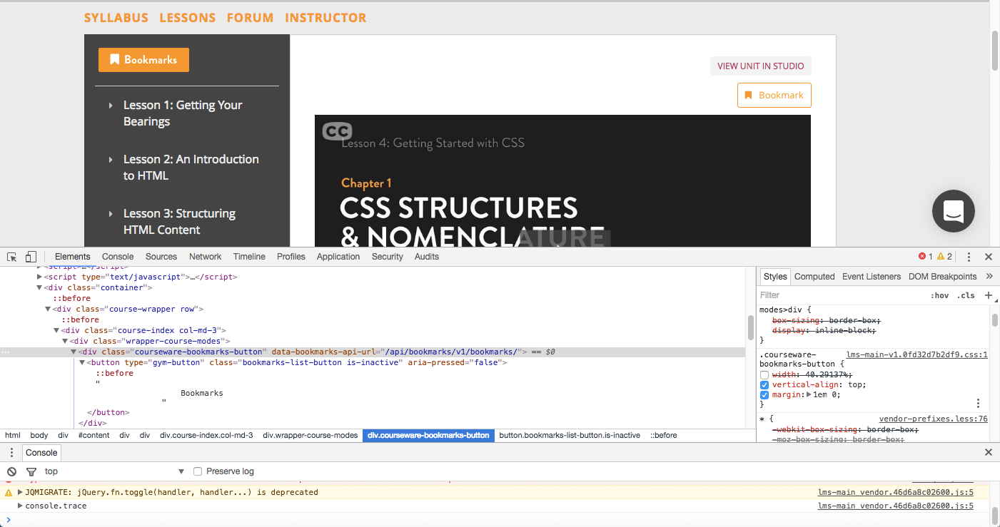
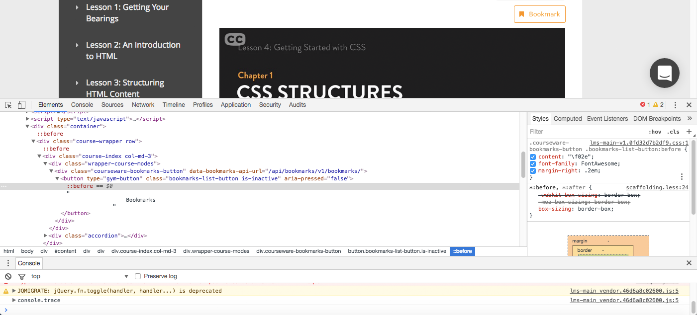
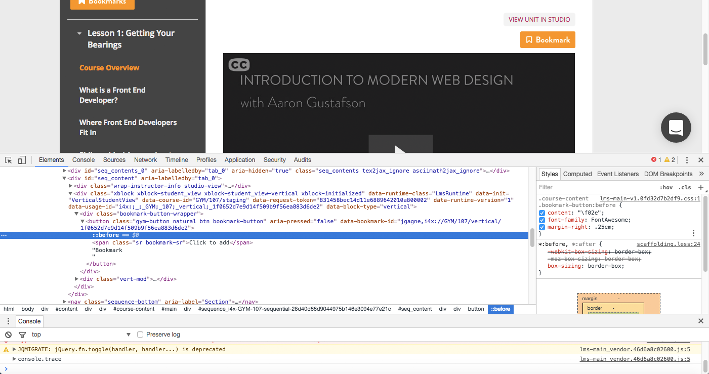
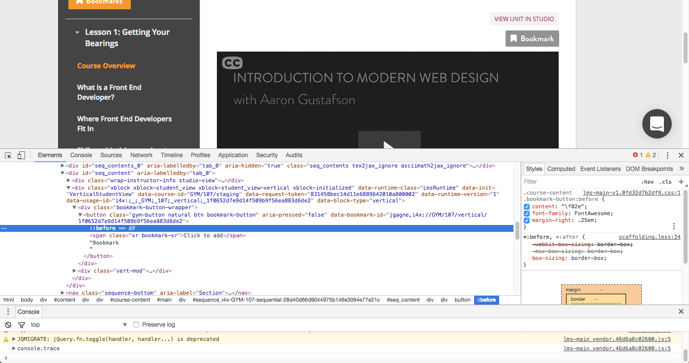

- - -

## left-hand column

**html**

```
<div class="course-index col-md-3">
```

**css**

```
@media (min-width: 992px)
.col-md-3 {
    /* width: 25%; */
}
```

- - -



- - -

## left-hand bookmark button container


**html**

```
<div class="courseware-bookmarks-button" data-bookmarks-api-url="/api/bookmarks/v1/bookmarks/">
  <button type="gym-button" class="bookmarks-list-button is-active" aria-pressed="true">
    Bookmarks
  </button>
</div>

```

**css**

```
.courseware-bookmarks-button {
    /* width: 40.29137%; */
    vertical-align: top;
    margin: 1em 0;
}
```


- - -

## left-hand bookmark button


**html**

```
<button type="gym-button" class="bookmarks-list-button is-active" aria-pressed="true">
  Bookmarks
</button>
```

**css**

```
.courseware-bookmarks-button .bookmarks-list-button.is-active {
    /* background-color: #1790c8; */
    color: #fff;
}
```

## left-hand bookmark button icon "generated content" (:before)



```
.courseware-bookmarks-button .bookmarks-list-button:before {
    content: "\f02e";
    font-family: FontAwesome;
}
```

- - -

## right-hand bookmark button


**html**

```
<button class="gym-button nature btn bookmark-button" …>
  <!-- remove &nbsp; -->Bookmark
</button>
```

**css**

```
.course-content .bookmark-button {
    border: 0;
    background: #f8971d;
    font-family: brandron-groteque, "Helvetica Neue", Helvetica, Arial, sans-serif;
    font-weight: bold;
    font-size: 1.2em;
    color: #fff;
}
```

## right-hand bookmark button icon "generated content" (:before)

```
.course-content .bookmark-button:before {
    content: "\f097"; /* outline */
    font-family: FontAwesome;
}
```

## right-hand inactive bookmark button



## right-hand hover bookmark button



## right-hand focus/active bookmark button


